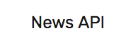

# coding=utf-8

News API Python Client
=================================



`newsapi` is a Python client to access worldwide news programmatically using the [News API standard web services](https://newsapi.org/). The client provides access to API version 1 and API version 2 data, where a few lines of code can return a [tidy data set ready for scientific or data-driven exploration](http://vita.had.co.nz/papers/tidy-data.pdf).


Each user must sign up for an API Key at the [News API website](https://newsapi.org/register/) to use `newsapi`; users will also find [documentation for the API along with explanations of parameters and examples of use](https://newsapi.org/docs).


Basic Usage
-------------------------------

```python

   import newsapi

   # create the object with or without authentication
   api = newsapi.Api(version=2,api_key=<enter apikey>)
   
   # api.SetCredentials(<enter apikey>) # alternative credentials entry

   # use version 2 news search by phrase or word of interst
   stories = api.searchnews(sources='usa-today',keywords='chiefs')

   sportsources = api.getsources(category='sport') # get sports providers

   headlines = api.getheadlines() # get headlines
```

You will only return the data allowed by your plan.  For details on how to
upgrade or change your plan, visit https://newsapi.org/pricing.

``newsapi`` can also retrieve version 1.0 API data.

```python

   import newsapi

   # create the object with or without authentication
   api = newsapi.Api(version=1,api_key=<enter apikey>)

   # use version 1 news search by phrase or word of interst
   # version 1 will ignore the keywords search
   stories = api.searchnews(sources='usa-today',keywords='chiefs')

   sportsources = api.getsources(category='politics')

```
